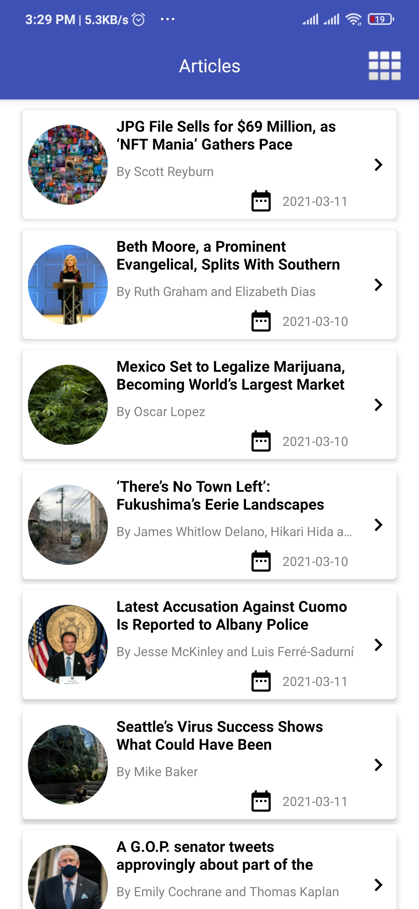
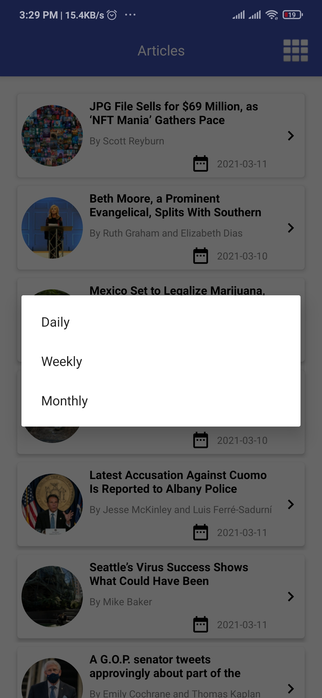
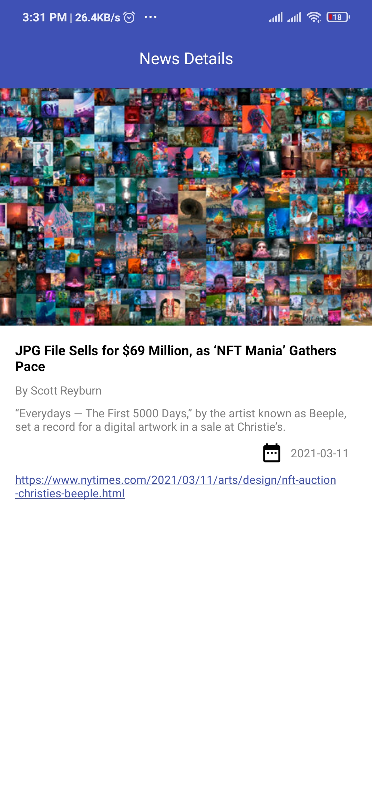

# NYTimesMostPopularArticles

A simple app to hit the NY Times Most Popular Articles API and show a list of articles, that shows details when items on the list are tapped (a typical master/detail app) that implements MVVM architecture using Dagger2, Retrofit, Coroutines, LiveData, RoomDatabase, DataBinding and Navigation Component.

 

    
    
    

 

## The app has following packages:
1. **data**: It contains all the data accessing and manipulating components.
2. **di**: Dependency providing classes using Dagger2.
3. **domain**: It contains dto classes and repositories.
4. **presentation**: View classes along with their corresponding Presenters.
5. **utils**: Utility classes.
#### Classes have been designed in such a way that it could be inherited and maximize the code reuse.
 

## Navigation Component Graph

    

 

## Guide to app architecture

    

 

## Technologies Used
- Kotlin
- Coroutines
- LiveData
- MVVM Clean Architecture
- Android Architure Components under Android Jetpack
    - NavigationView for navigation between fragments
    - Room Database for local caching
    - ViewModel for a lifecycle aware datastore
- Dagger2 for Dependency Injection
- Retrofit for remote API calls

## Setup & Installation
  - Download & Install [Android Studio](https://developer.android.com/studio)
  - Create an emulator using `Tools > AVD Manager > Create Virtual Device...`
  - Build & Run the project using `Run > Run 'app'` or the following command `./gradlew installDebug`

### Unit Tests
Run the tests using either class by class `Right-Click > Run 'TestClassName'` or by using the following command from terminal window `./gradlew test`
